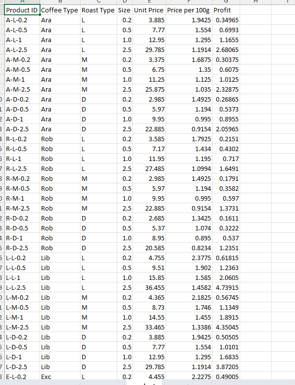

# Data Preparation Documentation - Coffee Products Analysis

## Data Examination
In the initial phase of the coffee products analysis project, I examined the product data which contains detailed information about various coffee products. Below is a summary of the fields:

### Product Data Fields:
- **Product ID**: Unique identifier combining coffee type, roast type, and size (e.g., "A-L-0.2")
- **Coffee Type**: Varietal (Ara, Rob, Lib, Exc)
- **Roast Type**: Roast level (L=Light, M=Medium, D=Dark)
- **Size**: Package weight in kilograms (0.2, 0.5, 1.0, 2.5)
- **Unit Price**: Retail price per package
- **Price per 100g**: Normalized price for comparison
- **Profit**: Calculated profit per unit

## Data Transformation
To prepare the data for efficient analysis, I performed the following transformation steps:

### 1. Data Structure Enhancement
- **Split Product ID**: Created separate columns for Coffee Type, Roast Type, and Size from the composite Product ID
- **Standardized Roast Levels**: Converted roast codes to full descriptions:
  - `L` → Light
  - `M` → Medium
  - `D` → Dark
- **Added Weight Class**: Created a categorical column for size groups:
  - Small (0.2kg)
  - Medium (0.5kg)
  - Large (1.0kg)
  - Bulk (2.5kg)

### 2. Data Cleaning
- **Validated Numerical Ranges**: Ensured all prices and profits were positive values
- **Checked for Missing Values**: Verified no null values in critical fields (Product ID, Unit Price)
- **Standardized Coffee Types**: Confirmed consistent naming (Ara, Rob, Lib, Exc)

### 3. Calculated Fields
- **Added Profit Margin**: Calculated percentage (Profit/Unit Price)
- **Created Price Tier**: Categorized products into:
  - Budget (<$10)
  - Mid-Range ($10-$20)
  - Premium (>$20)
- **Added Value Score**: Calculated metric combining price per 100g and profit margin

### 4. Data Validation
- **Cross-checked Calculations**: Verified Price per 100g matches (Unit Price/(Size×10))
- **Audited Profit Values**: Ensured consistent profit calculation methodology
- **Validated Product Combinations**: Confirmed all possible type-roast-size combinations exist

## Data Quality Notes
Key observations from the preparation process:

### Product Distribution:
- 4 coffee types × 3 roast levels × 4 sizes = 48 total products
- Complete matrix with no missing combinations

### Pricing Insights:
- Light roasts generally command higher prices than dark roasts
- Liberica (Lib) is the premium product line
- Robusta (Rob) offers the most budget-friendly options

### Profit Analysis:
- Larger package sizes yield higher absolute profits
- Price per 100g decreases with larger sizes (volume discount)
- Light roasts have highest profit margins

