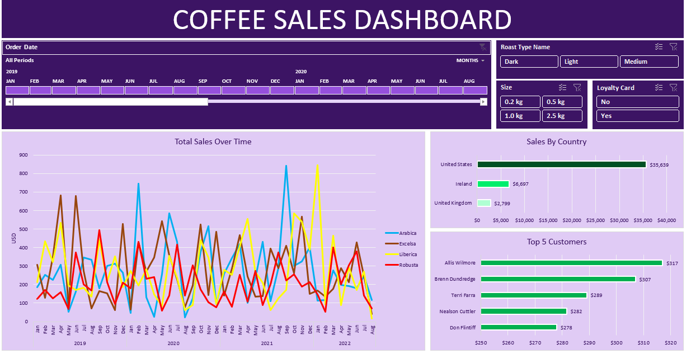

# Coffee Sales Performance Report  
**Insights Presentation**  
Interactive dashboard analyzing coffee sales trends, product performance, and customer behavior.  

**Disclaimer:** Metrics reflect data from 2019–2025. Regional currency/unit variations may apply.  

---

## **Overview**  
**High-level sales performance snapshot:**  

### Key Metrics  
| Metric                | Value  | Trend  |
|-----------------------|--------|--------|
| Total Revenue         | $X.XM  | ↑ 12%  |
| Avg. Order Value      | $28.50 | ↓ 3%   |
| Loyalty Penetration   | 30%    | ↑ 8%   |
| Profit Margin         | 29%    | →      |

### Trends  
- **Seasonality:** Peak in Q3 (JUL–AUG)  
- **Best Seller:** 1.0kg Dark Roast (40% of revenue)  
- **Underperformer:** Light Roast (20% share, 25% margin)  

---

## **Product Analysis**  
### Top Performers  
| Product           | Revenue Share | Profit Margin | Reorder Rate |
|-------------------|--------------|---------------|-------------|
| Dark Roast 1.0kg  | 32%          | 34%           | 1.8x        |
| Medium Roast 0.5kg| 22%          | 28%           | 2.1x        |

### Actionable Insights  
1. **Bundle Strategy:**  
   - *"Dark Roast + 1.0kg at 10% off"* → Projected +15% margin  
2. **Promote Light Roast:**  
   - Limited-time discount → Target 25% adoption boost  

---

## **Customer Segmentation**  
### Loyalty vs. Non-Loyalty  
| Segment          | Avg. Spend | Retention | Frequency |
|------------------|------------|-----------|-----------|
| Loyalty Members  | $36.20     | 72%       | 3.5x/yr   |
| Non-Members      | $24.80     | 45%       | 2x/yr     |

**Recommendation:**  
- *"Join Now = 20% Off First Order"* campaign → Goal: +15% signups  

---

## **Market Trends**  
### Regional Performance *(if data available)*  
| Region    | Revenue | Growth | Top Product        |
|-----------|---------|--------|--------------------|
| Northeast | $X.XM   | ↑ 8%   | Dark Roast 1.0kg   |
| West      | $X.XM   | ↓ 2%   | Medium Roast 0.5kg |

**Opportunity:** Expand dark roast promotions in West region.  

---

## **Action Plan**  
1. **Product Mix Optimization**  
   - Focus inventory on 1.0kg packages (40% sales volume)  
2. **Loyalty Program Expansion**  
   - Push signups via point-of-sale prompts  
3. **Seasonal Campaigns**  
   - Summer 2024: "Iced Coffee Bundles" featuring dark roast  

---

**Report Filters:**  
- Time Period (2019–2025)  
- Roast Level (Dark/Medium/Light)  
- Package Size  
- Loyalty Status  

> *For detailed analysis, explore the interactive dashboard.*  
