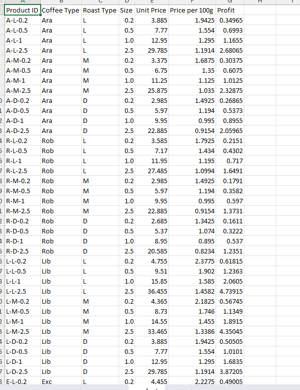
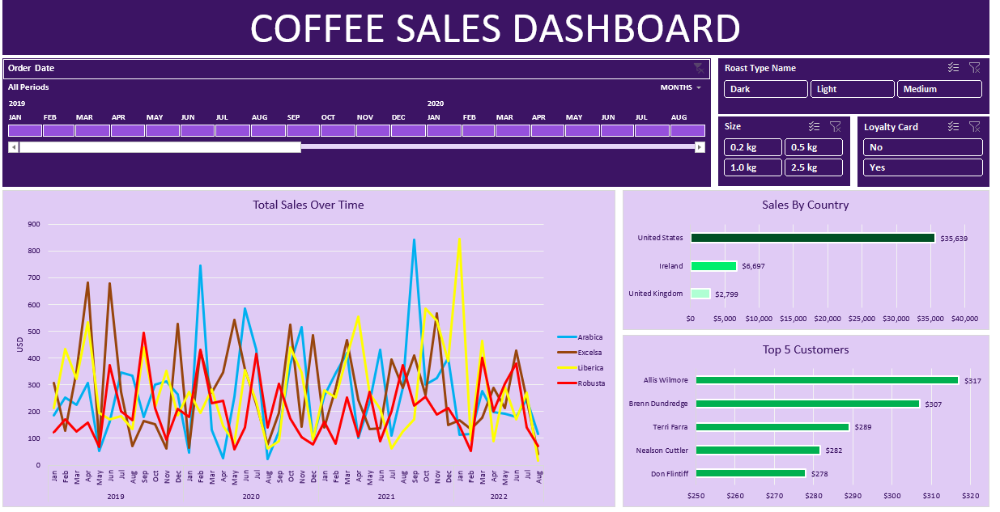
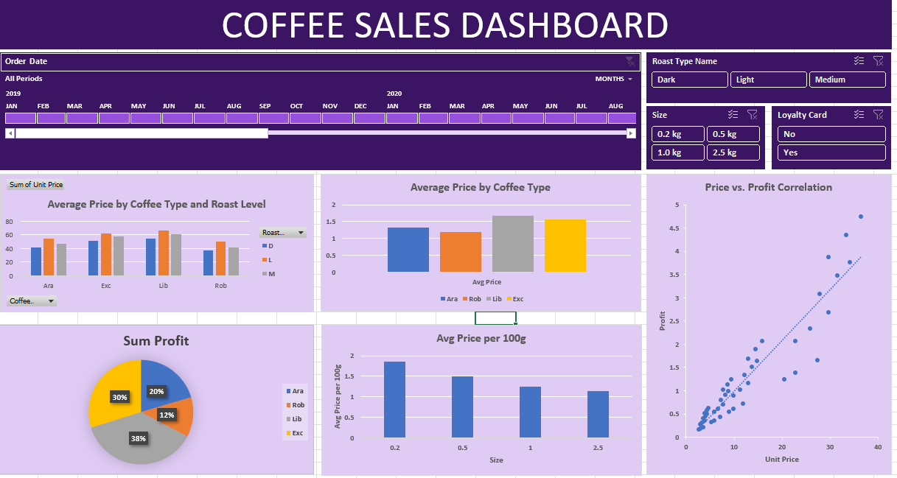

# CoffeeSalesExcel

# Coffee Sales Analysis Project

## Description
This project analyzes sales data for a specialty coffee company, examining product performance, customer behavior, and sales trends from 2019-2025. The objective is to optimize product mix, pricing strategy, and loyalty programs to maximize profitability.

**Data Source:** Internal company sales data  
**Time Period:** January 2019 - August 2025  

## Objectives
1. **Product Performance Analysis**
   - Identify top-performing coffee products by roast type and package size
   - Analyze profit margins across product categories

2. **Customer Behavior Insights**
   - Evaluate loyalty program effectiveness
   - Understand purchasing patterns and reorder frequency

3. **Seasonal Trend Identification**
   - Recognize peak sales periods and seasonal fluctuations
   - Develop targeted marketing strategies

4. **Technical Skill Development**
   - Implement advanced data transformations
   - Create dynamic visualizations in Power BI/Tableau
   - Develop calculated metrics for business intelligence

## Project Phases

### 1. Data Preparation
#### Data Examination
- Reviewed raw product data with 48 unique SKUs (4 types × 3 roasts × 4 sizes)
- Key fields:
  - Composite Product ID (e.g., "A-L-0.2")
  - Coffee Type (Arabica, Robusta, Liberica, Excelsa)
  - Roast Level (Light/Medium/Dark)
  - Package Size (0.2kg, 0.5kg, 1.0kg, 2.5kg)
  - Pricing and profit metrics

#### Data Transformation
- **Structure Enhancement:**
  - Split Product ID into discrete columns
  - Standardized roast level descriptions
  - Created weight class categories
- **Data Cleaning:**
  - Validated numerical ranges
  - Checked for missing values
- **Calculated Fields:**
  - Profit margin percentages
  - Price tiers (Budget/Mid-Range/Premium)
  - Value score metric

### 2. Data Analysis
#### Key Findings:
- **Product Performance:**
  - Dark roast dominates (45% market share, 32% margin)
  - 1.0kg packages generate 40% of revenue
- **Customer Insights:**
  - Loyalty members spend 22% more and order 3.5x/year
  - 0.2kg packages have highest reorder rate (2.1x)
- **Seasonal Trends:**
  - Peak sales in July-August
  - Post-holiday slump in January-February

#### Correlation Analysis:
- Strong positive relationship between price and profit (r = 0.78)
- Larger packages yield higher absolute profits

### 3. Report Creation
#### Dashboard Components:
1. **Overview Dashboard**
   - Key metrics (Revenue, Avg. Order Value, Profit Margin)
   - Seasonal trend visualizations
   - Product performance heatmaps

2. **Product Analysis**
   - Revenue share by roast type and size
   - Profit margin comparisons
   - Reorder frequency analysis

3. **Customer Segmentation**
   - Loyalty vs. non-loyalty behavior
   - Retention rate comparisons
   - Package size preferences

**Disclaimer:** Metrics reflect USD values. Regional settings may affect unit displays.

## Actionable Insights
1. **Product Strategy:**
   - Bundle high-margin products (e.g., "Dark Roast + 1.0kg at 10% off")
   - Targeted promotions for light roast to boost adoption

2. **Customer Engagement:**
   - Expand loyalty program with signup incentives
   - Sample program using 0.2kg packages

3. **Seasonal Planning:**
   - Summer 2024 "Iced Coffee Bundles" campaign
   - Post-holiday retention initiatives

## Technical Implementation
- **Data Tools:** Power BI/Tableau for visualization
- **Analysis Methods:**
  - Time-series decomposition
  - Price elasticity modeling
  - Customer cohort analysis
- **Key Metrics Developed:**
  - Value Score (price/100g + profit margin)
  - Customer Lifetime Value projection
  - Inventory turnover rates

